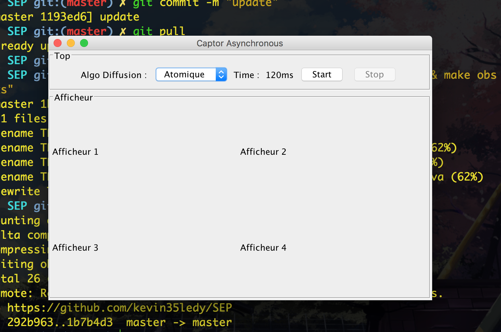

# SEP

## todo
- [X] Subject(I)
- [X] Observer<T> (I)
- [ ] ObserverdeCapteur(I)
- [X] AlgoDiffusion(I)
- [ ] DiffusionAtomique
- [ ] DiffusionSeq
- [X] Capteur(I)
- [ ] CapteurImpl
- [ ] Canal
- [ ] Afficheur
